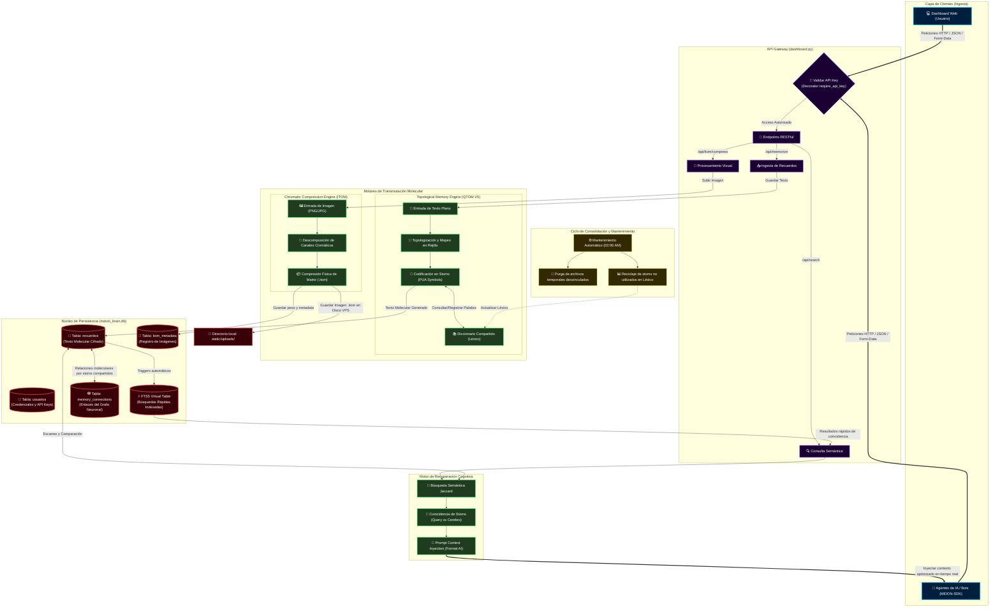

# Arquitectura Completa del Sistema MEION 🧠🧬

Este documento presenta una guía visual y técnica detallada sobre cómo opera el ecosistema de **MEION**, desde la ingesta de datos por parte de las Inteligencias Artificiales y los usuarios, hasta el procesamiento molecular topológico (**QTOM V5**), compresión cromática (**ITOM**) y persistencia de memoria a largo plazo.

---

## 🗺️ Diagrama de Flujo y Arquitectura de MEION

El siguiente diagrama de arquitectura en formato **Mermaid** describe paso a paso cómo viaja la información dentro del cerebro digital de MEION.

---

## ⚙️ Explicación Técnica de las Capas

### 1. Capa de Ingesta (Clientes)
Los recuerdos pueden provenir de dos fuentes principales:
* **Dashboard Web:** El usuario interactúa directamente de manera visual en una interfaz futurista (Dark Mode, Glassmorphism, animaciones CSS).
* **Agentes Inteligentes y Bots (MEION-SDK):** Sistemas externos (asistentes GPT, bots de Telegram, aplicaciones de escritorio) envían información a través del conector oficial en Python.

### 2. Capa de Seguridad y Ruteo (API Gateway)
Todo tráfico entrante pasa obligatoriamente por el decorador `@require_api_key` en `dashboard.py`:
* **Aislamiento:** Cada usuario cuenta con un espacio lógico aislado y encriptado. Una API Key comprometida no compromete el cerebro de otros usuarios.
* **Canales Separados:** Las solicitudes se separan en flujos textuales (/api/memorize) y cromáticos visuales (/api/itom/compress).

### 3. Motores de Transmutación Molecular
Es el corazón algorítmico y de compresión matemática de MEION:
* **QTOM V5:** No almacena palabras en texto plano. Analiza las sílabas del texto, las proyecta en una rejilla matemática tridimensional y las mapea en símbolos moleculares especiales (**Stoms**) que pertenecen al rango PUA (*Private Use Area* de Unicode). Esto permite representar ideas muy largas utilizando una fracción mínima de espacio en disco.
* **ITOM:** Descompone las imágenes en matrices de canales cromáticos moleculares y las guarda directamente en archivos ligeros `.itom`, logrando porcentajes de compresión asombrosos (habitualmente superiores al **70% de ahorro**).

### 4. Núcleo de Persistencia (SQLite & Disco)
Toda la información reside en `meion_brain.db`:
* **FTS5:** Permite realizar búsquedas rápidas textuales indexadas de manera extremadamente eficiente.
* **Triggers de SQLite:** Triggers automatizados sincronizan las inserciones, ediciones o eliminaciones de la tabla `recuerdos` con la tabla virtual de búsqueda FTS5 en tiempo real.
* **Grafo de Recuerdos (`memory_connections`):** Conecta dinámicamente recuerdos que comparten stoms (conceptos) similares para construir la red neuronal del usuario.

### 5. Recuperación Semántica Jaccard
Cuando una IA realiza una consulta (ej: *"¿Qué película le gusta a Sofia?"*):
1. MEION **comprime la consulta de la IA** a stoms.
2. Utiliza el **Coeficiente de Similitud Jaccard** para comparar la intersección de stoms de la pregunta con todos los recuerdos guardados del usuario en la base de datos.
3. Ordena los resultados por mayor score semántico y fecha.
4. Genera un bloque de contexto limpio y formateado listo para inyectarse directamente en el prompt del LLM (GPT, Claude, Llama).

---

> [!TIP]
> **Privacidad Absoluta:** Debido a que el texto se guarda en formato molecular (stoms codificados en PUA), si un intruso lograra acceder a la base de datos `meion_brain.db`, solo vería cadenas de símbolos ininteligibles. Solo el usuario autenticado con su API Key correspondiente tiene el poder de restaurar las moléculas a texto legible.
